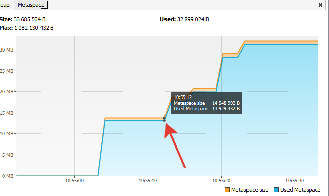

**Домашнее задание для Netology.ru для курса Java Developer**

**Описание и инструкция к выполнению [здесь](https://github.com/netology-code/jd-homeworks/tree/master/jvm/README.md)**

10:54:41: Executing ':JvmExperience.main()'...

< Task :compileJava
< Task :processResources NO-SOURCE
< Task :classes

< Task :JvmExperience.main()

Please open 'ru.netology.JvmExperience' in VisualVm

10:55:12.160356100: loading io.vertx // загрузка классов из пакета io.vertx в metaspace

10:55:12.672358100: loaded 529 classes // загружено 529 классов, на графике Classes видно увеличение
числа классов, значение на графике Heap немного подросло

10:55:15.676389300: loading io.netty // загрузка классов из пакета io.netty в metaspace

10:55:16.684395600: loaded 2117 classes // загружено 2117 классов, значение на графике Classes значительно выросло,
значение Heap снизилось в результате работы Garbage Collector, значение Metaspace значительно выросло

10:55:19.686416700: loading org.springframework // загрузка классов из пакета org.springframework в metaspace

10:55:20.057417200: loaded 869 classes // загружено 869 классов, значение Classes выросло, продолжил рости Metaspace

10:55:23.057432600: now see heap// информационное сообщении о необходимости смотреть на загрузку в куче

10:55:23.058432700: creating 5000000 objects // создание 5 млн объектов

10:55:23.640453700: created // создано 5 млн объектов, количество классов практически не изменилось,
значение Heap выросло из-за сознания большого количества объектов

10:55:26.641460700: creating 5000000 objects // создание 5 млн объектов

10:55:27.163478900: created // создано 5 млн объектов,
значение Heap выросло из-за сознания большого количества объектов

10:55:30.263503900: creating 5000000 objects // создание 5 млн объектов

10:55:30.745514100: created // создано 5 млн объектов, зарезервированное значение Heap выросло,
а использованное снизилось в результате работы Garbage Collector

BUILD SUCCESSFUL in 52s // Программа завершила работу, перед этим
зарезервированное и использованное значение Heap выросло

2 actionable tasks: 1 executed, 1 up-to-date
10:55:34: Execution finished ':JvmExperience.main()'.

